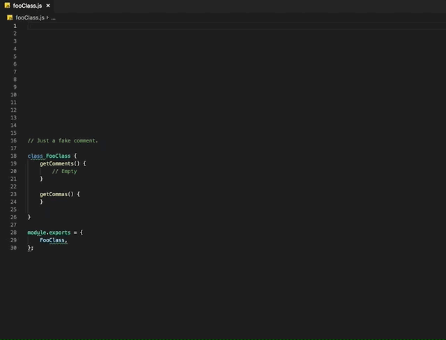
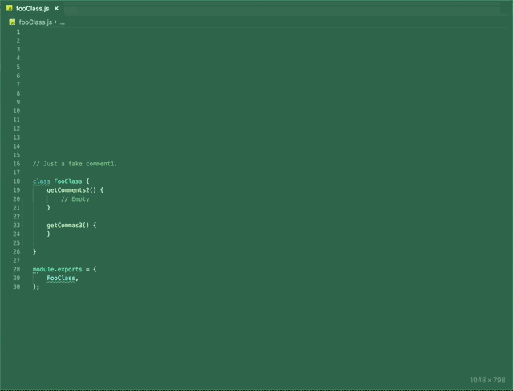

# Transformer Plus

Tranformer Plus is a Visual Studio Code extension that provides a set of a commands that aid in the manipulation of text and generation of multiple selections. 

All commands support the following:
- Full JavaScript expressions using standard syntax e.g. `return someValue;` or REPL-style syntax e.g.  `someValue`.
- Imports using `require` where the require imports modules from the current project.
- Typing `?` will show help for the current command.
- History for each command is saved (last 10 unique entries).
- Live preview as you type. Press ENTER to keep your changes or ESC to cancel them.
- Each command is provided a set a variables you can use in your expressions (see help using `?` for the list of variables and their descriptions).

## Features/Commands

### Selections From Regex
Creates selections from regex.

### Transform
Transforms text.

### Selections
Creates selections from start-end chracter index array(s) (per-line).

### Generator
Generates text based on expression.

## Requirements

Person + Computer + Visual Studio Code

## Extension Settings

None currently.

## Known Issues

None currently.

## Release Notes

This is the initial release of `Transformer Plus`.

### 1.0.0

Initial release.

<!-- -----------------------------------------------------------------------------------------------------------

## Working with Markdown

**Note:** You can author your README using Visual Studio Code.  Here are some useful editor keyboard shortcuts:

* Split the editor (`Cmd+\` on macOS or `Ctrl+\` on Windows and Linux)
* Toggle preview (`Shift+CMD+V` on macOS or `Shift+Ctrl+V` on Windows and Linux)
* Press `Ctrl+Space` (Windows, Linux) or `Cmd+Space` (macOS) to see a list of Markdown snippets

### For more information

* [Visual Studio Code's Markdown Support](http://code.visualstudio.com/docs/languages/markdown)
* [Markdown Syntax Reference](https://help.github.com/articles/markdown-basics/)

**Enjoy!** -->
